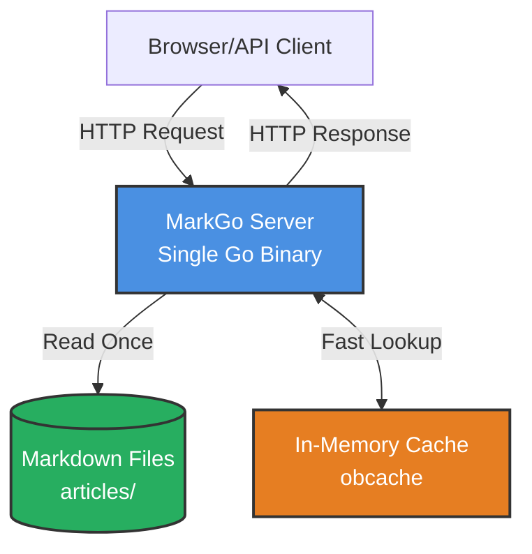
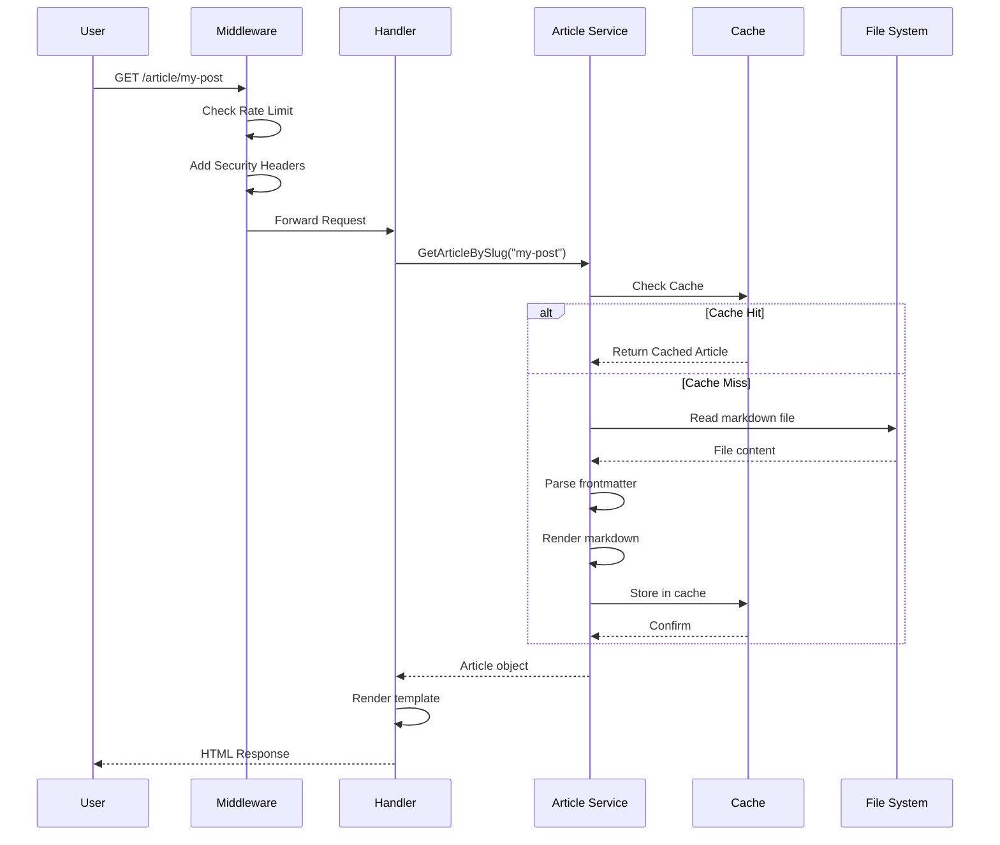
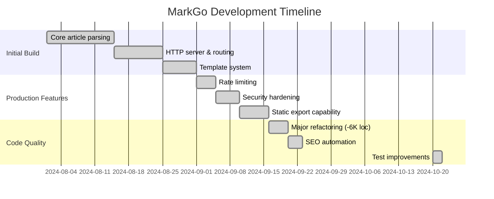
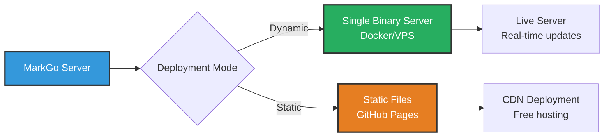
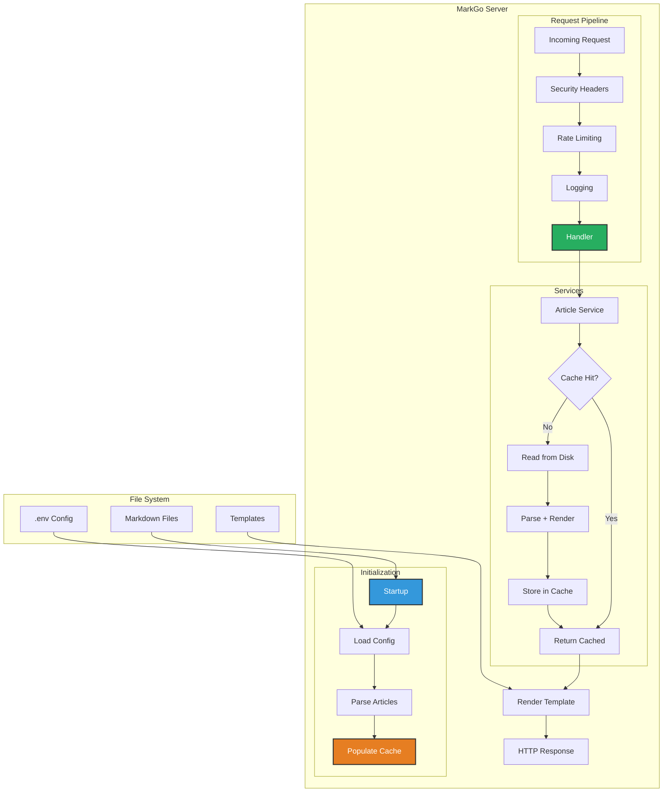

# Building MarkGo: A Developer's Journey

*October 2024*

After spending way too much time fighting with WordPress plugins and waiting for Ghost to cold start, I decided to build something different. Not because the world needed another blog engine, but because I wanted one that worked the way I think about content: files in a folder, version controlled, no database complexity.

This is the story of building MarkGo - the decisions made, the mistakes fixed, and the lessons learned.

## The Problem I Actually Had

I maintain several technical blogs. Every time I wanted to write something, I'd face this workflow:

1. Log into WordPress admin
2. Fight with the block editor
3. Lose formatting when copying from my markdown notes
4. Wait 30 seconds for the page to load (seriously, why?)
5. Remember my content is locked in a MySQL database somewhere

Or with static generators like Hugo:
1. Write markdown (good!)
2. Run build command
3. Upload 500 files to S3
4. Hope nothing breaks
5. No way to quickly test a draft without rebuilding everything

I wanted something in between: the simplicity of markdown files, but the flexibility of a running server when I needed it.

## Architecture: Keep It Boring

The architecture ended up being pretty straightforward. No microservices, no message queues, just a single Go binary that does its job.



The core idea: read markdown files once at startup, cache everything in memory, serve fast. When you change a file in development, it reloads automatically. In production, restart the server (takes less than a second anyway).

## Request Flow: What Actually Happens

When you request an article, here's what happens:



The first request reads from disk. Every subsequent request? Pure memory. That's how we get those response times.

## The Refactoring That Mattered

Early on, I made a classic mistake: over-engineering. I built elaborate object pools, complex caching layers, and unnecessary abstractions. The codebase hit 15,000 lines.

Then I deleted 6,000 of them.

### What I Removed

**Complex Object Pools**: Turned out Go's garbage collector is pretty good. The pools added complexity with zero measurable benefit.

**Memory Profilers Everywhere**: In development, sure. But having them in production code? Premature optimization.

**Elaborate Handler Chains**: Originally had 7 layers of abstraction. Now? 2. The code is easier to debug and actually faster.

### What I Kept

**Middleware Pattern**: Clean separation of concerns. Security, logging, rate limiting - each middleware does one thing.

**Service Layer**: Separates business logic from HTTP handling. Makes testing way easier.

**Table-Driven Tests**: This was a recent win. Converted 1,193 lines of repetitive test code into 300 lines of table-driven tests. Same coverage, way more maintainable.

## Performance: The Numbers

I won't claim MarkGo is the "fastest" anything. But here's what I measured on my M1 MacBook:

- **Cold start**: 800ms to first request
- **Memory**: 30MB resident (including caching 100+ articles)
- **Response time**: 2-5ms for cached articles
- **Binary size**: 38MB (includes everything)

Compare that to:
- **Ghost**: 150-300ms response time, but needs Node.js + SQLite (~200MB)
- **WordPress**: 500-1000ms response time, PHP + MySQL stack

The real win isn't raw speed - it's deployment simplicity. One binary. No database. No runtime dependencies.

## Development Timeline

Here's how the project actually evolved:



## Security: Learning the Hard Way

I initially implemented CORS using substring matching. Bad idea.

```go
// WRONG - allows localhost.evil.com
if strings.Contains(origin, "localhost") {
    // Allow it
}
```

Someone pointed out you could bypass this with `localhost.evil.com`. Oops.

Fixed version:

```go
// RIGHT - exact match only
allowedMap := make(map[string]bool)
for _, origin := range allowedOrigins {
    allowedMap[origin] = true
}

if allowedMap[origin] {
    // Actually allowed
}
```

Lesson: security is in the details. Also, document your security decisions. I created [SECURITY.md](SECURITY.md) to explain every choice.

## The Static Export Trick

Here's a neat feature: MarkGo can run as a server OR export to static files.



Same codebase, two deployment options:

**Dynamic Mode**: Run the server, articles update instantly. Great for personal blogs where you control the server.

**Static Mode**: Export everything to HTML/CSS/JS. Upload to GitHub Pages. Free hosting, global CDN, no server to maintain.

I use static mode for documentation sites and dynamic mode for my main blog. Same markdown files, different deployment.

## Testing: What Actually Works

I tried different testing strategies:

### What Didn't Work

**Interface Compliance Tests**: Go's type system already enforces interfaces at compile time. These tests provided zero value.

```go
// Deleted this entire file
func TestServicesImplementInterfaces(t *testing.T) {
    var _ ArticleService = (*ArticleServiceImpl)(nil)
    // This is checked at compile time anyway!
}
```

**Verbose Individual Tests**: Had 1,193 lines of tests like:

```go
func TestPortZero(t *testing.T) { /* test code */ }
func TestPortNegative(t *testing.T) { /* test code */ }
func TestPortTooLarge(t *testing.T) { /* test code */ }
// ... hundreds more
```

### What Did Work

**Table-Driven Tests**: Replaced all that with:

```go
tests := []struct {
    name    string
    port    int
    wantErr bool
}{
    {"port zero", 0, true},
    {"port negative", -1, true},
    {"port too large", 70000, true},
    {"port valid", 3000, false},
}

for _, tt := range tests {
    t.Run(tt.name, func(t *testing.T) {
        // test logic once
    })
}
```

Result: 75% less code, same coverage, way easier to add new cases.

**Real HTTP Tests**: Testing middleware by actually starting an HTTP server in tests. Sure, it's slower, but it catches real bugs:

```go
func TestCORSProtection(t *testing.T) {
    server := httptest.NewServer(handler)
    defer server.Close()

    // Make real HTTP requests, check real headers
    resp, _ := http.Get(server.URL + "/api/articles")
    assert.Equal(t, "nosniff", resp.Header.Get("X-Content-Type-Options"))
}
```

## Code Organization: Decisions That Stuck

The folder structure is pretty standard Go:

```
markgo/
├── cmd/                    # Binaries (server, CLI tools)
├── internal/              # Private packages
│   ├── config/           # Environment & validation
│   ├── handlers/         # HTTP handlers
│   ├── middleware/       # Request pipeline
│   ├── models/           # Data structures
│   └── services/         # Business logic
├── web/                   # Templates & static files
└── articles/              # User content (markdown)
```

Why `internal/`? It's a Go convention that prevents other projects from importing these packages. Good for marking "this is implementation detail, not API."

## What I'd Do Differently

**Start with Table-Driven Tests**: Would've saved weeks of refactoring later.

**Skip the Object Pools**: Went straight for "optimization" without measuring first. Classic mistake.

**Write SECURITY.md Earlier**: Had to retrofit security documentation after launch. Should've been part of the initial design.

**Use More Mermaid Diagrams**: Turns out people actually read documentation when it has pictures. Who knew?

## Current State

After several months and lots of refactoring:

- **8,205 lines** of documentation
- **~15,000 lines** of Go code (after removing 6,000 lines of cruft)
- **65.8% test coverage** on core packages
- **Zero lint reports** (down from 273)

The codebase is maintainable, documented, and actually pleasant to work on.

## Data Flow: How Everything Connects

Here's the complete picture of how data moves through MarkGo:



## SEO: The Unexpected Journey

Initially, SEO was an afterthought. Then I realized: if you're building a blogging platform, people actually care about being found on Google.

Added:
- Dynamic sitemap generation (updates automatically)
- Schema.org structured data (helps Google understand your content)
- Open Graph tags (nice previews on social media)
- Twitter Cards (because why not?)

The interesting bit: all of this is generated at runtime from your markdown frontmatter. No manual configuration needed.

## Lessons for Other Developers

If you're building something similar:

1. **Start simple**. You can always add complexity later (but you probably won't need to).

2. **Measure before optimizing**. I wasted time on "optimizations" that made zero difference.

3. **Documentation is code**. If it's not documented, it doesn't exist.

4. **Test the interfaces, not the implementation**. Your tests should survive refactoring.

5. **Security is not optional**. CORS, rate limiting, input validation - build them in from day one.

6. **One binary deployment is underrated**. Not having to manage dependencies in production is amazing.

## What's Next

Current version is v1.6.0. It's feature-complete for my needs. Future plans:

- **Better caching strategies**: Maybe LRU eviction instead of TTL
- **Plugin system**: For people who want to extend functionality
- **Admin UI**: Right now it's CLI only
- **Performance benchmarks**: Proper comparison with other platforms

But honestly? I might just use it for a while before adding more features. Sometimes done is better than perfect.

## Try It Yourself

If this sounds interesting, check out the [Quick Start](README.md#quick-start).

The code is on [GitHub](https://github.com/vnykmshr/markgo), MIT licensed. Use it, fork it, break it, fix it.

And if you find bugs (you will), [open an issue](https://github.com/vnykmshr/markgo/issues). I actually read them.

---

*Building MarkGo taught me more about Go, HTTP servers, and keeping things simple than any tutorial could. If you're learning, I recommend building something similar - even if it already exists. The journey is the point.*
