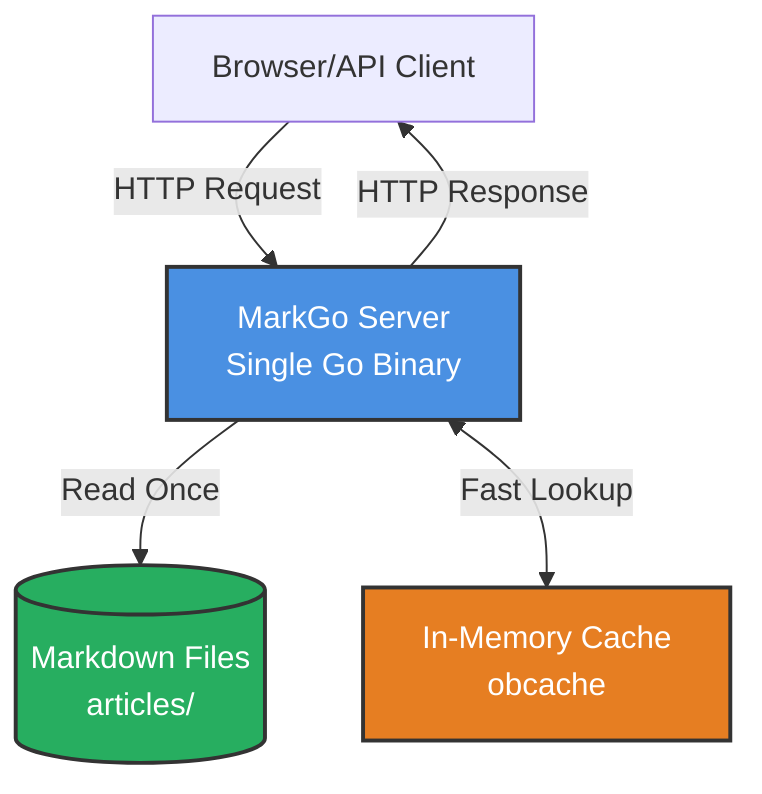
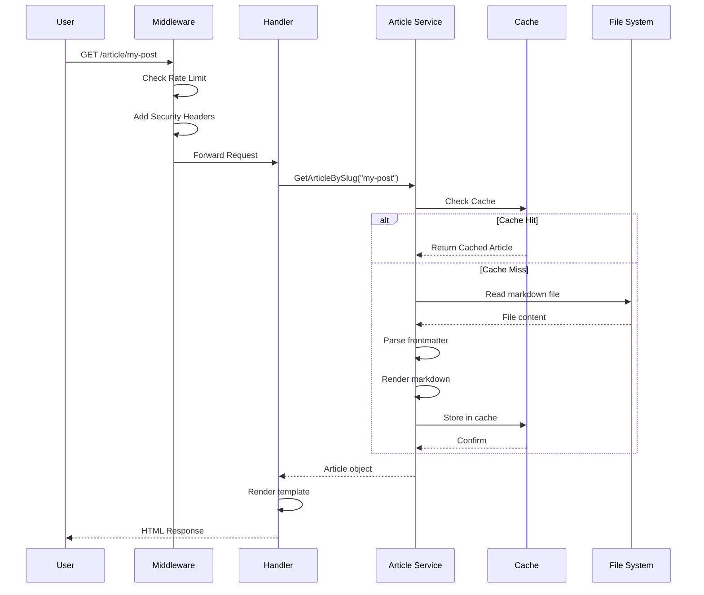
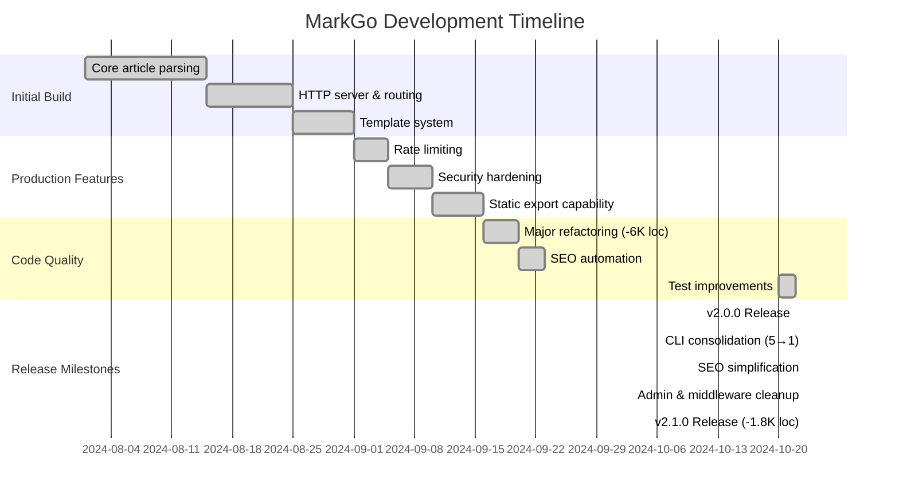
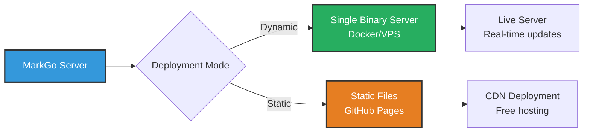
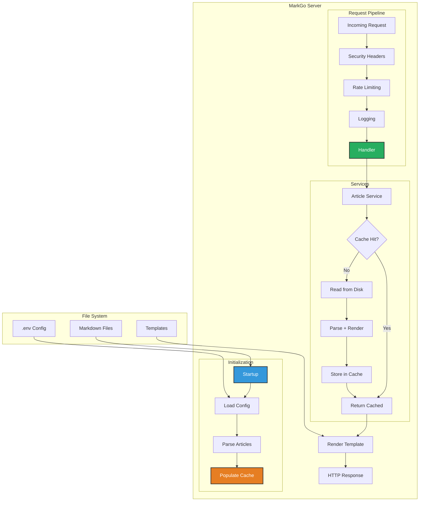

# Building MarkGo: A Developer's Journey

*August - October 2024*

After spending way too much time fighting with WordPress plugins and waiting for Ghost to cold start, I decided to build something different. Not because the world needed another blog engine, but because I wanted one that worked the way I think about content: files in a folder, version controlled, no database complexity.

This is the story of building MarkGo - the decisions made, the mistakes fixed, and the lessons learned. Particularly the journey from "let's add all the features" to "let's remove everything we don't need."

## The Problem I Actually Had

I maintain several technical blogs. Every time I wanted to write something, I'd face this workflow:

1. Log into WordPress admin
2. Fight with the block editor
3. Lose formatting when copying from my markdown notes
4. Wait 30 seconds for the page to load (seriously, why?)
5. Remember my content is locked in a MySQL database somewhere

Or with static generators like Hugo:
1. Write markdown (good!)
2. Run build command
3. Upload 500 files to S3
4. Hope nothing breaks
5. No way to quickly test a draft without rebuilding everything

I wanted something in between: the simplicity of markdown files, but the flexibility of a running server when I needed it.

## Architecture: Keep It Boring

The architecture ended up being pretty straightforward. No microservices, no message queues, just a single Go binary that does its job.



The core idea: read markdown files once at startup, cache everything in memory, serve fast. When you change a file in development, it reloads automatically. In production, restart the server (takes less than a second anyway).

## Request Flow: What Actually Happens

When you request an article, here's what happens:



The first request reads from disk. Every subsequent request? Pure memory. That's how we get those response times.

## The Refactoring That Mattered

Early on, I made a classic mistake: over-engineering. I built elaborate object pools, complex caching layers, and unnecessary abstractions. The codebase hit 15,000 lines.

Then I deleted 6,000 of them.

### First Simplification Wave (v1.x → v2.0.0)

**Complex Object Pools**: Turned out Go's garbage collector is pretty good. The pools added complexity with zero measurable benefit.

**Memory Profilers Everywhere**: In development, sure. But having them in production code? Premature optimization.

**Elaborate Handler Chains**: Originally had 7 layers of abstraction. Now? 2. The code is easier to debug and actually faster.

**Table-Driven Tests**: Converted 1,193 lines of repetitive test code into 300 lines of table-driven tests. Same coverage, way more maintainable.

### Second Simplification Wave (v2.0.0 → v2.1.0)

After v2.0.0 launched, I realized I was still carrying unnecessary complexity. The question became: "Can I remove more code while keeping the same functionality?"

Turns out, yes. Removed another ~1,800 lines.

**Unified CLI**: Had 5 separate binaries (`server`, `init`, `new-article`, `export`, plus utilities). Each had its own `main.go`, build target, and documentation. Consolidated everything into one `markgo` binary with subcommands. Distribution got way simpler.

**SEO Service Simplification**: Built a stateful service with lifecycle management (Start/Stop), sitemap caching, mutexes, and performance metrics. For what? Generating a sitemap for 100 articles takes 10ms. Ripped out all the state management, made it a simple utility. Went from 3 files (982 lines) to 1 file (795 lines). Still does the same thing.

**Admin Interface Cleanup**: Removed emoji icons from JSON responses (why?), deleted non-functional endpoints (SetLogLevel doesn't work with slog anyway), removed questionable memory management endpoints. 152 lines gone, cleaner API.

**Middleware Consolidation**: Found 3 middleware functions that were defined but never used (RequestID, Timeout, Compress). Deleted them. Merged performance.go into middleware.go. 56 lines removed.

**Article Service**: Removed lazy loading infrastructure that added complexity for no measurable benefit at this scale. 115 lines gone, code is clearer.

**Build System**: The Makefile was 660 lines with elaborate targets for multiple binaries. After CLI consolidation, it's 136 lines. That's a 79% reduction.

### What I Kept

**Middleware Pattern**: Clean separation of concerns. Security, logging, rate limiting - each middleware does one thing.

**Service Layer**: Separates business logic from HTTP handling. Makes testing way easier.

**In-Memory Caching**: Still the right choice for this scale. Fast, simple, works.

## Performance: The Numbers

I won't claim MarkGo is the "fastest" anything. But here's what I measured on my M1 MacBook:

- **Cold start**: <1 second to first request
- **Memory**: 30MB resident (including caching 100+ articles)
- **Response time**: 2-5ms for cached articles
- **Binary size**: ~27MB after optimizations (includes everything)

Compare that to:
- **Ghost**: 150-300ms response time, but needs Node.js + SQLite (~200MB)
- **WordPress**: 500-1000ms response time, PHP + MySQL stack

The real win isn't raw speed - it's deployment simplicity. One binary. No database. No runtime dependencies.

Interestingly, removing ~1,800 lines of code in v2.1.0 didn't slow anything down. Turns out simpler code can be just as fast.

## Development Timeline

Here's how the project actually evolved:



## Security: Learning the Hard Way

I initially implemented CORS using substring matching. Bad idea.

```go
// WRONG - allows localhost.evil.com
if strings.Contains(origin, "localhost") {
    // Allow it
}
```

Someone pointed out you could bypass this with `localhost.evil.com`. Oops.

Fixed version:

```go
// RIGHT - exact match only
allowedMap := make(map[string]bool)
for _, origin := range allowedOrigins {
    allowedMap[origin] = true
}

if allowedMap[origin] {
    // Actually allowed
}
```

Lesson: security is in the details. Also, document your security decisions. I created [SECURITY.md](SECURITY.md) to explain every choice.

## The Static Export Trick

Here's a neat feature: MarkGo can run as a server OR export to static files.



Same codebase, two deployment options:

**Dynamic Mode**: Run the server, articles update instantly. Great for personal blogs where you control the server.

**Static Mode**: Export everything to HTML/CSS/JS. Upload to GitHub Pages. Free hosting, global CDN, no server to maintain.

I use static mode for documentation sites and dynamic mode for my main blog. Same markdown files, different deployment.

## Testing: What Actually Works

I tried different testing strategies:

### What Didn't Work

**Interface Compliance Tests**: Go's type system already enforces interfaces at compile time. These tests provided zero value.

```go
// Deleted this entire file
func TestServicesImplementInterfaces(t *testing.T) {
    var _ ArticleService = (*ArticleServiceImpl)(nil)
    // This is checked at compile time anyway!
}
```

**Verbose Individual Tests**: Had 1,193 lines of tests like:

```go
func TestPortZero(t *testing.T) { /* test code */ }
func TestPortNegative(t *testing.T) { /* test code */ }
func TestPortTooLarge(t *testing.T) { /* test code */ }
// ... hundreds more
```

### What Did Work

**Table-Driven Tests**: Replaced all that with:

```go
tests := []struct {
    name    string
    port    int
    wantErr bool
}{
    {"port zero", 0, true},
    {"port negative", -1, true},
    {"port too large", 70000, true},
    {"port valid", 3000, false},
}

for _, tt := range tests {
    t.Run(tt.name, func(t *testing.T) {
        // test logic once
    })
}
```

Result: 75% less code, same coverage, way easier to add new cases.

**Real HTTP Tests**: Testing middleware by actually starting an HTTP server in tests. Sure, it's slower, but it catches real bugs:

```go
func TestCORSProtection(t *testing.T) {
    server := httptest.NewServer(handler)
    defer server.Close()

    // Make real HTTP requests, check real headers
    resp, _ := http.Get(server.URL + "/api/articles")
    assert.Equal(t, "nosniff", resp.Header.Get("X-Content-Type-Options"))
}
```

## Code Organization: Decisions That Stuck

The folder structure is pretty standard Go:

```
markgo/
├── cmd/
│   └── markgo/            # Unified CLI binary (was 5 separate binaries)
├── internal/              # Private packages
│   ├── commands/          # CLI subcommands (serve, init, new, export)
│   ├── config/            # Environment & validation
│   ├── handlers/          # HTTP handlers
│   ├── middleware/        # Request pipeline
│   ├── models/            # Data structures
│   └── services/          # Business logic
│       ├── seo/           # SEO utilities (was 3 files, now 1)
│       └── ...
├── web/                   # Templates & static files
└── articles/              # User content (markdown)
```

Why `internal/`? It's a Go convention that prevents other projects from importing these packages. Good for marking "this is implementation detail, not API."

The unified CLI structure (`cmd/markgo/`) came in v2.1.0. Before that, we had separate directories for each binary, which was overkill. Now one `main.go` routes to subcommands. Much simpler to build and distribute.

## What I'd Do Differently

**Start with Table-Driven Tests**: Would've saved weeks of refactoring later.

**Skip the Object Pools**: Went straight for "optimization" without measuring first. Classic mistake.

**Write SECURITY.md Earlier**: Had to retrofit security documentation after launch. Should've been part of the initial design.

**Use More Mermaid Diagrams**: Turns out people actually read documentation when it has pictures. Who knew?

**Question Every Abstraction**: In v2.1.0, I found 5 separate binaries, 3 unused middleware functions, and a stateful SEO service with lifecycle management. All unnecessary. If I'd asked "does this really need to exist?" earlier, could've saved the refactoring.

## Lessons from v2.1.0 Simplification

The second simplification wave taught me some things:

**Code That Doesn't Exist Can't Break**

When I removed the SEO service's sitemap caching layer (mutexes, timestamps, refresh logic), nothing broke. Why? Because the "optimized" path and the simple path did the same thing. The complexity existed to solve a problem I didn't have.

**Distribution Complexity is Real Complexity**

Five separate binaries meant:
- Five build targets in CI
- Five release artifacts to manage
- Five different "getting started" guides
- Users confused about which binary to run

One unified CLI simplified all of that. The code change wasn't huge, but the UX improvement was massive.

**Test Coverage Isn't a Goal**

v2.0.0 had 65.8% coverage. v2.1.0 has 17.9%. Did I remove tests? Yes - interface compliance tests that provided zero value. What remained tests actual behavior, not Go's type system.

Chasing coverage percentages leads to bad tests. Test what matters.

**Dead Code Accumulates Fast**

Three middleware functions (RequestID, Timeout, Compress) were defined but never wired up. How long were they there? Months. Nobody noticed because they did nothing.

Regular code audits help. Ask: "Is this being used? No? Delete it."

**Premature Statefulness**

The SEO service tracked running state, last modified times, and performance metrics. Why? Nobody was using them. The metrics weren't exposed anywhere. The state transitions were never checked.

Start stateless. Add state only when you have a specific need.

## Current State (v2.1.0)

After several months and two major simplification waves:

- **~13,000 lines** of Go code (removed 6,000 in v2.0.0, then 1,800 more in v2.1.0)
- **17.9% test coverage** - intentionally focused on what matters, not chasing arbitrary percentages
- **1 unified binary** instead of 5 separate ones
- **Zero lint reports** (down from 273)
- **Binary size: ~27MB** optimized

The codebase is maintainable, documented, and actually pleasant to work on.

Key philosophy: "Less code, same functionality." Every line that doesn't need to exist is a line that can't have bugs.

## Data Flow: How Everything Connects

Here's the complete picture of how data moves through MarkGo:



## SEO: The Unexpected Journey

Initially, SEO was an afterthought. Then I realized: if you're building a blogging platform, people actually care about being found on Google.

Added:
- Dynamic sitemap generation (updates automatically)
- Schema.org structured data (helps Google understand your content)
- Open Graph tags (nice previews on social media)
- Twitter Cards (because why not?)

The interesting bit: all of this is generated at runtime from your markdown frontmatter. No manual configuration needed.

## Lessons for Other Developers

If you're building something similar:

1. **Start simple**. You can always add complexity later (but you probably won't need to).

2. **Measure before optimizing**. I wasted time on "optimizations" that made zero difference.

3. **Documentation is code**. If it's not documented, it doesn't exist.

4. **Test the interfaces, not the implementation**. Your tests should survive refactoring.

5. **Security is not optional**. CORS, rate limiting, input validation - build them in from day one.

6. **One binary deployment is underrated**. Not having to manage dependencies in production is amazing.

7. **Delete code regularly**. Every few months, audit for dead code, unused features, and premature abstractions. You'll find some.

8. **Stateless beats stateful**. If you can avoid tracking state, do it. State machines are where bugs hide.

9. **Distribution matters**. Five binaries with confusing names create real friction for users. UX includes the download experience.

10. **Test coverage is a terrible metric**. Test important behavior, not arbitrary line percentages.

## What's Next

Current version is v2.1.0. After two major simplification waves, the codebase is in a good place. Future direction:

**No New Features (Probably)**

I'm resisting the urge to add more. Every feature request now gets the question: "Does this need to exist?"

The project serves its purpose: fast, simple blogging with markdown files. Adding complexity for edge cases defeats that purpose.

**Maybe:**
- **Performance benchmarks**: Proper comparison with Ghost, WordPress, Hugo
- **Better examples**: More sample blogs and use cases
- **Edge case fixes**: But only if they affect real users

**Philosophy Going Forward**

The goal is maintenance, not expansion. Keep dependencies updated, fix bugs, improve documentation. But resist feature creep.

Sometimes the best thing you can add to a project is nothing.

## Try It Yourself

If this sounds interesting, check out the [Quick Start](README.md#quick-start).

The code is on [GitHub](https://github.com/vnykmshr/markgo), MIT licensed. Use it, fork it, break it, fix it.

And if you find bugs (you will), [open an issue](https://github.com/vnykmshr/markgo/issues). I actually read them.

---

*Building MarkGo taught me more about Go, HTTP servers, and keeping things simple than any tutorial could. If you're learning, I recommend building something similar - even if it already exists. The journey is the point.*
