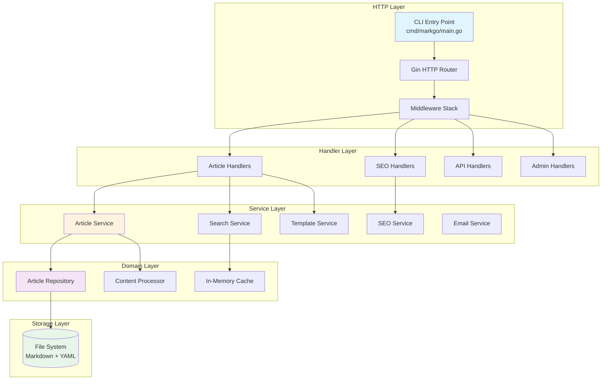
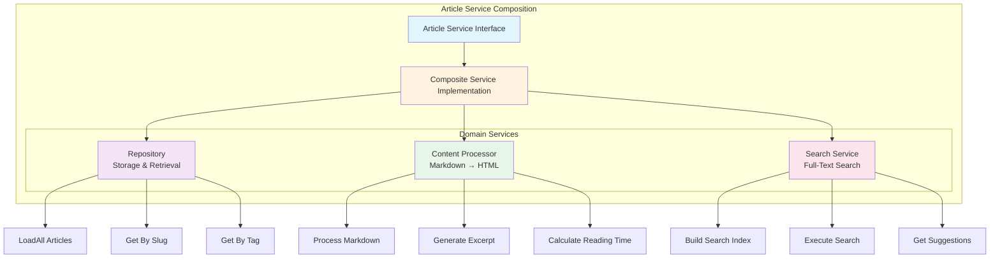
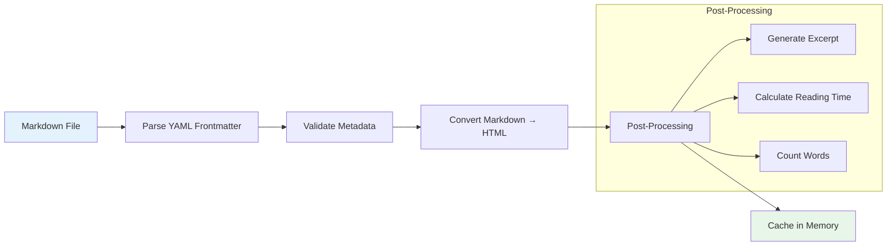
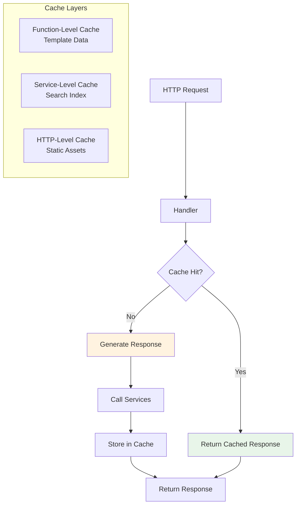
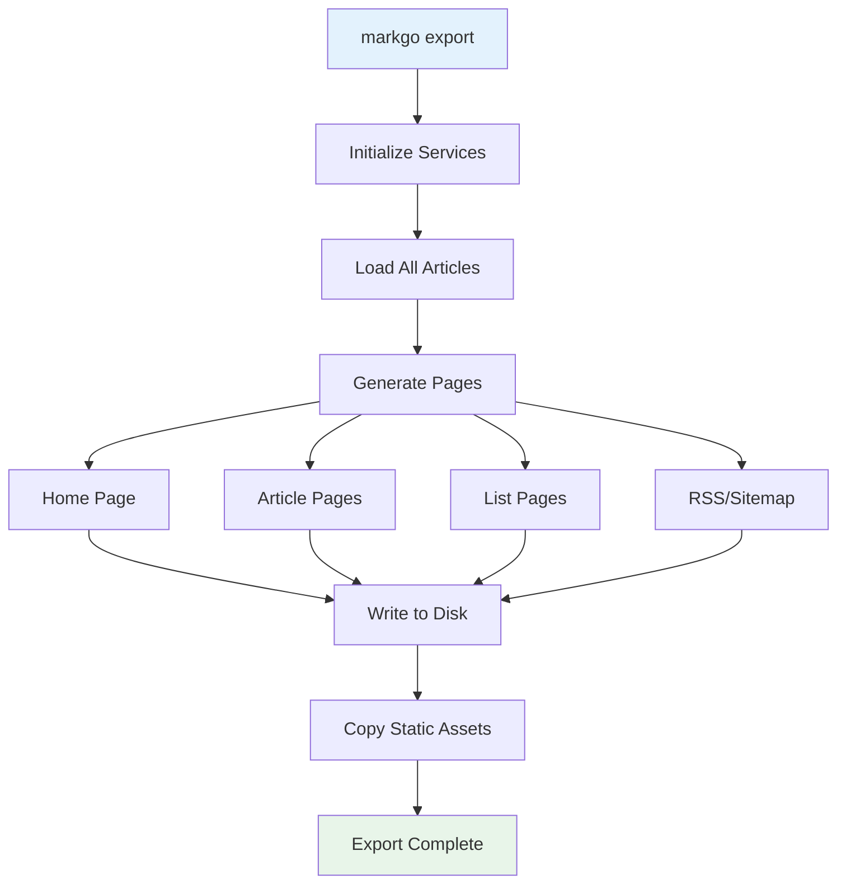

# Building a High-Performance Blog Engine: Architecture and Design Decisions

## Introduction

Modern blogging platforms face a persistent trade-off: dynamic systems like WordPress offer flexibility but consume significant resources, while static generators like Hugo eliminate runtime overhead but sacrifice dynamic capabilities. MarkGo bridges this gap by providing both deployment models from a single codebase—a lightweight dynamic server that can export to static HTML.

The challenge MarkGo addresses is straightforward: how do you build a blog engine that starts in under a second, runs in 30MB of memory, requires no external dependencies, yet still provides full-text search, SEO automation, and dynamic content updates without page regeneration?

## Rationale

The blogging landscape is dominated by two paradigms:

**Dynamic CMSs** (WordPress, Ghost) offer real-time updates and rich admin interfaces but require databases, complex dependencies, and consume 100-200MB of memory. They excel at collaborative editing but impose operational overhead.

**Static Generators** (Hugo, Jekyll) produce fast, secure sites with minimal runtime requirements but require full rebuilds for content changes and lack dynamic features like search.

MarkGo was designed for technical writers and developers who:
- Want Git-based content management with version control
- Need deployment flexibility (dynamic or static)
- Value operational simplicity (single binary, no dependencies)
- Require production features (search, SEO, caching) without complexity

## Value Proposition

MarkGo delivers three core benefits:

1. **Operational Simplicity**: Single ~27MB binary with zero runtime dependencies. No Node.js, PHP, Python, or databases. Deploy via Docker, systemd, or static export to any host.

2. **Deployment Flexibility**: Run as a dynamic server for live updates and search, or export to static HTML for GitHub Pages, Netlify, or Vercel. Switch modes without code changes.

3. **Performance by Default**: Sub-second startup, 30MB memory footprint, in-memory caching, and built-in rate limiting. Production-ready without performance tuning.

## Architecture Overview

MarkGo follows a layered architecture with clear separation of concerns:



### Middleware Stack

The middleware pipeline provides cross-cutting concerns without handler code pollution:


**Key Middleware Components:**

- **Security**: Sets X-Content-Type-Options, X-Frame-Options, X-XSS-Protection headers
- **CORS**: Validates origins against whitelist (no wildcards in production)
- **Rate Limiting**: Sliding window algorithm with bounded memory (max 10k unique IPs)
- **Performance**: Tracks request duration, logs slow requests (>1s)

### Service Architecture

MarkGo uses composite service patterns for modularity:



**Design Decisions:**

1. **Interface-Based Design**: All services implement interfaces for testability and future extensibility
2. **Composite Pattern**: Complex services compose simpler domain services
3. **Single Responsibility**: Each service handles one concern (storage, processing, search)

## Content Management

MarkGo uses a file-based approach with Markdown and YAML frontmatter:

```markdown
---
title: "Article Title"
description: "SEO description"
date: 2024-01-15T10:00:00Z
published: true
tags: ["golang", "architecture"]
categories: ["Technical"]
author: "Author Name"
---

# Article Content

Your markdown content here...
```

**Processing Pipeline:**



**Key Design Choices:**

- **File System as Source of Truth**: No database complexity; Git provides versioning
- **Eager Loading**: All articles loaded at startup for instant access
- **Hot Reload**: File watcher detects changes without restart (development mode)

## Caching Strategy

MarkGo implements multi-layer caching for optimal performance:



**Cache Invalidation:**

- **Time-Based (TTL)**: Default 1-hour TTL for rendered pages
- **Event-Based**: Cache cleared on article reload/update
- **Selective**: Different TTLs for different content types

## Search Implementation

Full-text search without external dependencies:

```go
// Simplified search index structure
type SearchIndex struct {
    Articles map[string]*models.Article
    Tokens   map[string][]string // token -> article slugs
}

// Build index at startup
func BuildSearchIndex(articles []*models.Article) SearchIndex {
    index := SearchIndex{
        Articles: make(map[string]*models.Article),
        Tokens:   make(map[string][]string),
    }

    for _, article := range articles {
        index.Articles[article.Slug] = article

        // Tokenize title, content, tags
        tokens := tokenize(article.Title + " " + article.Content)
        for _, token := range tokens {
            index.Tokens[token] = append(index.Tokens[token], article.Slug)
        }
    }

    return index
}
```

**Search Features:**

- **Full-Text Search**: Title, content, and tag matching
- **Relevance Ranking**: TF-IDF-inspired scoring
- **Search Suggestions**: Prefix matching on indexed terms
- **O(1) Lookup**: Hash-based token index

## SEO Automation

MarkGo generates SEO metadata automatically:

```go
// SEO metadata generation
func GenerateArticleMetadata(article *models.Article, config *config.Config) SEOData {
    return SEOData{
        // Schema.org structured data
        Schema: SchemaArticle{
            Type:            "BlogPosting",
            Headline:        article.Title,
            Description:     article.Description,
            DatePublished:   article.Date,
            Author:          config.Blog.Author,
            WordCount:       article.WordCount,
        },

        // Open Graph tags
        OpenGraph: OpenGraphData{
            Type:        "article",
            Title:       article.Title,
            Description: article.Description,
            URL:         buildURL(config.BaseURL, article.Slug),
            Image:       getArticleImage(article),
        },

        // Twitter Card tags
        TwitterCard: TwitterCardData{
            Card:        "summary_large_image",
            Title:       article.Title,
            Description: article.Description,
        },
    }
}
```

**Generated Assets:**

- **Sitemap XML**: Auto-generated from published articles
- **RSS/JSON Feeds**: Recent articles feed
- **robots.txt**: Configurable crawl rules
- **Meta Tags**: Title, description, canonical URL

## Static Export

MarkGo can export the entire site to static HTML:



**Export Process:**

1. Start article service (loads all content)
2. Render all page types using template service
3. Generate RSS, sitemap, robots.txt
4. Copy static assets (CSS, JS, images)
5. Write output to target directory

**Use Cases:**

- Deploy to GitHub Pages, Netlify, Vercel
- Create archival snapshots
- CDN distribution
- Offline browsing

## CLI Design

Unified command-line interface with subcommands:

```bash
# Start dynamic server (default)
markgo
markgo serve --port 3000

# Initialize new blog
markgo init --quick

# Create new article
markgo new --title "Hello World" --tags "intro"

# Export to static HTML
markgo export --output ./dist --base-url https://example.com
```

**Implementation:**

```go
// Simplified CLI routing
func main() {
    if len(os.Args) < 2 {
        serve.Run(os.Args) // Default to serve
        return
    }

    command := os.Args[1]
    subArgs := append([]string{os.Args[0]}, os.Args[2:]...)

    switch command {
    case "serve", "server", "start":
        serve.Run(subArgs)
    case "init", "initialize":
        init.Run(subArgs)
    case "new", "create", "article":
        new.Run(subArgs)
    case "export", "build":
        export.Run(subArgs)
    default:
        showHelp()
    }
}
```

## Configuration Management

Environment-based configuration with validation:

```go
// Configuration structure
type Config struct {
    Environment   string
    Port          int
    ArticlesPath  string
    BaseURL       string

    Server        ServerConfig
    Cache         CacheConfig
    RateLimit     RateLimitConfig
    Blog          BlogConfig
    SEO           SEOConfig
}

// Load from environment variables or .env file
func Load() (*Config, error) {
    godotenv.Load() // Optional .env file

    cfg := &Config{
        Environment: getEnv("ENVIRONMENT", "development"),
        Port:        getEnvInt("PORT", 3000),
        ArticlesPath: getEnv("ARTICLES_PATH", "./articles"),
        // ... more config
    }

    // Validate configuration
    if err := cfg.Validate(); err != nil {
        return nil, err
    }

    return cfg, nil
}
```

**Configuration Features:**

- **12-Factor App**: Environment variables for all config
- **Sensible Defaults**: Works out-of-box for development
- **Validation**: Comprehensive checks with clear error messages
- **Environment-Aware**: Different defaults for dev/prod/test

## Real-World Applications

### Use Case 1: Technical Blog

**Scenario**: Developer maintaining a technical blog with code examples and tutorials.

**MarkGo Advantages**:
- Markdown with syntax highlighting
- Git-based workflow (write locally, commit, push)
- Fast search across all articles
- SEO optimized for Google indexing

**Deployment**: Dynamic server on a $5/month VPS or static export to GitHub Pages (free).

### Use Case 2: Documentation Site

**Scenario**: Open-source project needing searchable documentation.

**MarkGo Advantages**:
- Organized by categories and tags
- Full-text search without external service
- Version control via Git
- Static export for CDN distribution

**Deployment**: Static export to Netlify with continuous deployment from GitHub.

### Use Case 3: Personal Website

**Scenario**: Professional maintaining a portfolio with blog posts.

**MarkGo Advantages**:
- Low maintenance (no database, no updates)
- Fast load times (30MB memory, instant startup)
- Professional SEO (Schema.org, Open Graph)
- Custom styling via templates

**Deployment**: Docker container on any cloud provider or static export.

## Key Design Decisions

### 1. File-Based Storage Over Database

**Decision**: Use file system with Markdown files instead of a database.

**Rationale**:
- Eliminates database dependency and operational complexity
- Enables Git-based version control and collaboration
- Makes content portable (easy migration, backups)
- Reduces resource requirements (no DB connections, queries)

**Trade-offs**:
- Limited to thousands of articles (not millions)
- No relational queries (acceptable for blog use case)
- Requires eager loading (fine with modern memory)

### 2. In-Memory Caching Over External Cache

**Decision**: Implement in-memory cache instead of Redis/Memcached.

**Rationale**:
- Eliminates external dependency
- Faster access (no network hop)
- Simpler deployment (single binary)
- Sufficient for single-server deployments

**Trade-offs**:
- No cache sharing across multiple instances (use load balancer session affinity)
- Lost on restart (acceptable with fast startup)

### 3. Composite Services Over Monolithic Service

**Decision**: Use composed domain services instead of one large service.

**Rationale**:
- Clear separation of concerns
- Easier testing (mock individual services)
- Better maintainability (change one without affecting others)
- Follows Single Responsibility Principle

**Trade-offs**:
- More interfaces and types
- Slightly more complex initialization

### 4. Both Dynamic and Static Modes

**Decision**: Support both server and static export modes.

**Rationale**:
- Different users have different deployment preferences
- Dynamic mode offers search and live updates
- Static mode offers maximum performance and simplicity
- Single codebase reduces maintenance

**Trade-offs**:
- More complex export implementation
- Need to ensure feature parity between modes

## Performance Characteristics

### Startup Time

```
Cold start:   < 1 second
With 100 articles: ~500ms
With 1000 articles: ~2 seconds
```

### Memory Footprint

```
Base server:   ~30MB
With 100 articles:  ~35MB
With 1000 articles: ~50MB
```

### Request Latency

```
Home page (cached):    < 1ms
Article page (cached): < 1ms
Search query:          5-10ms
Full reload:           200-500ms
```

### Concurrency

```
Gin framework:  Excellent (goroutines per request)
Rate limiting:  100 req/15min per IP (configurable)
Max clients:    10,000 unique IPs tracked
```

## When to Use MarkGo

**Good Fit:**

- Technical blogs with 10-1000 articles
- Documentation sites for open-source projects
- Personal websites with blog functionality
- Projects valuing operational simplicity
- Teams comfortable with Markdown and Git

**Not Recommended:**

- Multi-author publishing platforms (no collaborative admin UI)
- Sites requiring complex user management
- Applications needing relational data queries
- Very large sites (>10,000 articles)
- Teams requiring WYSIWYG editing

## Conclusion

MarkGo demonstrates that blog engines don't need to choose between dynamic flexibility and static simplicity. By leveraging Go's performance characteristics and a carefully layered architecture, it delivers both deployment modes from a single codebase.

The key insights are:

1. **Simplicity scales**: File-based storage and in-memory caching eliminate complexity without sacrificing functionality
2. **Interfaces enable flexibility**: Clean abstractions allow both dynamic and static modes from the same core
3. **Performance by design**: Architectural decisions (eager loading, in-memory indexing) make optimization unnecessary
4. **Git is enough**: For version control and collaboration, Git provides everything a blog needs

MarkGo proves that modern blog engines can be powerful, performant, and operationally simple—without compromise.

## Further Reading

- [Architecture Guide](architecture.md) - Deep dive into system design
- [API Documentation](API.md) - HTTP endpoints and responses
- [Configuration Guide](configuration.md) - All configuration options
- [Deployment Guide](deployment.md) - Production deployment strategies
- [Static Export Guide](static-export.md) - Static site generation

---

*MarkGo is open source under the MIT license. Contributions welcome at [github.com/vnykmshr/markgo](https://github.com/vnykmshr/markgo).*
